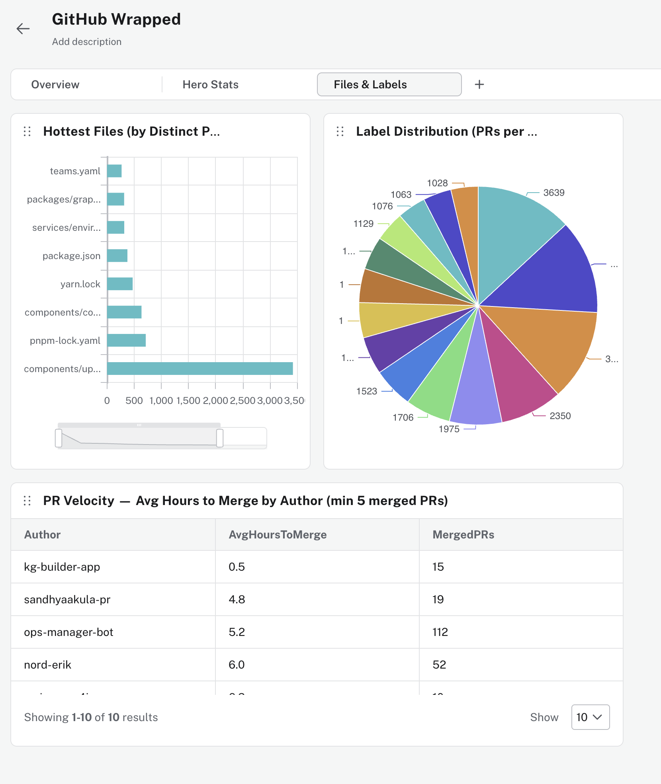

# 🎸 github4j — GitHub Wrapped × Neo4j

> *Your year (or quarter, or sprint) in code. Spotify Wrapped, but make it graphs.*

Built at the Neo4j hackathon 🦾. Six CSVs of GitHub activity go in — contributor glory, collaboration graphs, and bug-slaying leaderboards come out. Vibe coded with Claude + Neo4j.

---

## 🗺️ What's inside

| Layer | What it does |
|---|---|
| 🕸️ **Graph import** | 6 CSVs → Neo4j AuraDB property graph (persons, repos, PRs, reviews, files, labels) |
| 📊 **NeoDash dashboard** | 10 pre-built panels — top contributors, PR velocity, hottest files, label heatmap |
| 🌐 **Web app** | GitHub Pages site with Wrapped-style hero stats + NVL interactive collaboration graph |
| 🔬 **GDS notebook** | Louvain community detection + PageRank — do the informal teams match the org chart? |
| 🤖 **MCP server** | FastAPI endpoint Claude can query: *"who fixed the most bugs?"* |

---

## ⚡ Quickstart

### 1. 🌩️ Get an AuraDB instance

Free tier at [neo4j.com/cloud/aura](https://neo4j.com/cloud/aura) — takes 2 minutes. Save your **Bolt URI** (`neo4j+s://...`) and password.

### 2. 🌱 Seed the database

```bash
# install uv if you don't have it
curl -LsSf https://astral.sh/uv/install.sh | sh

git clone https://github.com/jexp/github4j
cd github4j

NEO4J_URI=neo4j+s://xxxx.databases.neo4j.io \
NEO4J_USER=neo4j \
NEO4J_PASSWORD=your-password \
uv run seed.py

# AuraDB Free tier? Skip the large TOUCHES import:
uv run seed.py --skip-touches
```

Reads from local `data/` — no remote CSV fetching, fast batched Python.

> ⚠️ **AuraDB Free tier note:** Full import creates ~507k relationships. `--skip-touches` drops 206k `TOUCHES` rels to stay under the 400k limit. All hero stats still work!

### 3. 🌐 Open the web app

```bash
cd docs && python3 -m http.server 8080
# → http://localhost:8080
```

Enter your AuraDB **Bolt URI** (`neo4j+s://...`) on first load — stored in `localStorage`, never committed.

Or open the live demo:

> **🌐 Live demo: [https://www.jexp.de/github4j/](https://www.jexp.de/github4j/)**

The app uses the **Neo4j JS driver over WebSocket (Bolt)**, so there are no CORS issues — Bolt runs over `wss://` (WebSocket), which is not subject to the HTTP CORS policy. No AuraDB allowlist configuration is needed. 🎉

To host your own fork on GitHub Pages: Settings → Pages → Source: `docs/` folder, branch `main`.

### 4. 📊 Load the NeoDash dashboard



1. Go to [neodash.graphapp.io](https://neodash.graphapp.io) (or AuraDB → Apps → NeoDash)
2. New dashboard → Import → paste `dashboards/github-wrapped.json`
3. Connect to your AuraDB instance

### 5. 📜 Run the LOAD CSV scripts (alternative to seed.py)

If you prefer Cypher directly in AuraDB Browser or cypher-shell:

```
import/01_persons.cypher
import/02_repos.cypher
import/03_files.cypher
import/04_prs.cypher
import/05_reviews.cypher
import/06_files_touched.cypher   ← optional, see note above
```

CSVs fetched from `raw.githubusercontent.com/jexp/github4j/main/data/`.

### 6. ✅ Verify the import

Paste `import/verify.cypher` into AuraDB Browser — checks node counts, relationship counts, and runs the hero stat queries.

---

## 🏆 Hero stats

**🗑️ The Great Deleter** — who deleted the most lines of code? Sometimes the best PR is the one that removes 10,000 lines. A true hero of maintainability.

**🐛 Bug Slayer** — ranked by merged PRs carrying the `bug` label. The unsung heroes keeping production alive.

---

## 🕸️ Graph schema

```
(:Person)-[:AUTHORED]->(:PullRequest)-[:IN_REPO]->(:Repo)
(:Person)-[:REVIEWED]->(:PullRequest)
(:Person)-[:MERGED]->(:PullRequest)
(:PullRequest)-[:HAS_LABEL]->(:Label)
(:PullRequest)-[:TOUCHES {additions, deletions}]->(:File)
(:File)-[:IN_DIR]->(:Directory)
```

---

## 🔬 GDS notebook (community detection)

```bash
uv sync --extra notebook   # first time only — installs graphdatascience, neo4j-viz, python-dotenv
uv run --extra notebook jupyter notebook notebooks/github_gds.ipynb
```

Credentials are loaded automatically from `integration.env` in the project root (same file used by `seed.py` and `verify.py`):

```
NEO4J_URI=neo4j+s://xxxx.databases.neo4j.io
NEO4J_USERNAME=neo4j
NEO4J_PASSWORD=your-password
```

Runs **Louvain community detection** on the collaboration graph (who reviews whose PRs) and compares detected communities against `team-*` labels. Are the informal teams the same as the org chart? Probably not. 👀

Visualised with `neo4j-viz`. Community IDs written back to `Person.community` in AuraDB.

---

## 🤖 MCP server (Claude integration)

### Run locally

```bash
cd mcp_server
NEO4J_URI=... NEO4J_PASSWORD=... uv run uvicorn main:app --reload
```

### Deploy to Railway (recommended)

1. Install the [Railway CLI](https://docs.railway.app/develop/cli): `npm i -g @railway/cli`
2. Log in: `railway login`
3. From `mcp_server/`:

```bash
cd mcp_server
railway init          # creates a new project
railway variables set NEO4J_URI=neo4j+s://xxxx.databases.neo4j.io
railway variables set NEO4J_USERNAME=neo4j
railway variables set NEO4J_PASSWORD=your-password
railway variables set NEO4J_DATABASE=neo4j
railway up            # deploys — get the public URL from the dashboard
```

Railway auto-detects `pyproject.toml` + `uv.lock` via Nixpacks and builds with uv.
The `mcp_server/railway.toml`, `Procfile`, and `nixpacks.toml` are already configured.

### Deploy to Vercel (alternative)

```bash
cd mcp_server
npm i -g vercel
vercel env add NEO4J_URI
vercel env add NEO4J_USERNAME
vercel env add NEO4J_PASSWORD
vercel env add NEO4J_DATABASE
vercel --prod
```

Configuration is in `mcp_server/vercel.json`.

### Use with Claude

Add `<your-public-url>/openapi.json` as a tool in Claude Projects and ask:

- 💬 *"Who are the top 5 bug fixers?"*
- 💬 *"Which file is touched by the most PRs?"*
- 💬 *"What communities did Louvain detect?"*
- 💬 *"Who should review my PR in the kernel team?"*

Smoke-test the deployment:
```bash
curl https://<your-public-url>/
curl https://<your-public-url>/openapi.json | jq '.info.title'
curl "https://<your-public-url>/tools/get_top_contributors?metric=prs&limit=5"
```

> **Note:** No AuraDB credentials are stored in any committed file. All secrets are configured as environment variables in the hosting platform.

---

## 📁 Data files

| File | Rows | Description |
|---|---|---|
| `data/persons.csv` | 348 | 👤 GitHub users |
| `data/repos.csv` | 14 | 📦 Repositories |
| `data/prs.csv` | 32,252 | 🔀 Pull requests |
| `data/reviews.csv` | 92,721 | 👀 PR reviews |
| `data/files.csv` | 52,996 | 📄 Files in repos |
| `data/files_touched.csv` | 206,196 | ✏️ Files changed per PR |

---

## 🛠️ Built with

- [Neo4j AuraDB](https://neo4j.com/cloud/aura) 🌩️ — managed graph database
- [NeoDash](https://neodash.graphapp.io) 📊 — no-code graph dashboards
- [NVL](https://neo4j.com/docs/nvl/current/) 🕸️ — Neo4j Visualization Library (JS)
- [neo4j-viz](https://neo4j.com/docs/python-graph-visualization/current/) 🐍 — Python graph viz wrapper
- [neo4j-rust-ext](https://pypi.org/project/neo4j-rust-ext/) ⚡ — fast Neo4j Python driver (Rust-backed)
- [graphdatascience](https://neo4j.com/docs/graph-data-science/current/python-client/) 🔬 — GDS Python client
- [uv](https://astral.sh/uv) 🚀 — Python package manager
- [Claude](https://claude.ai) 🤖 — vibe coded the whole thing
